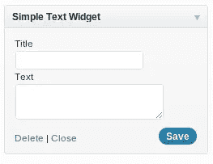
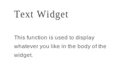

# WordPress 插件开发

> 原文：<https://www.sitepoint.com/wordpress-plugin-development/>

如果你曾经使用过 WordPress 快速建立一个网站，那么你很有可能使用过许多插件来扩展这个流行的博客软件的功能。插件是 WordPress 如此吸引人的众多原因之一。如果你需要一个图片库或者联系方式，可能已经有一个插件可以下载使用了。然而，有时候你不能从现有的插件中找到你需要的东西。这篇文章将通过一个例子向你展示如何创建你自己的 WordPress 插件，在侧边栏中使用一个小部件显示一些文本。

## 主插件文件

插件会自动从 WordPress 安装目录下的`wp-content/plugins`目录中检测出来。当创建一个新的插件时，你应该在那里创建一个新的子目录。子目录的名称可以是您想要的任何名称；一个明智的选择是把它叫做你的插件的名字。尽量避免使用通用名称，如“textwidget”或“shoppingcart ”,因为这可能已经被另一个插件使用，如果你想把它分发给 WordPress 的其他用户，会引起问题。对于这个例子，创建一个名为`phpmaster_examplewidget`的子目录。

WordPress 从 PHP 文件注释中的描述符检测到一个插件是可用的。描述符必须提供关于插件做什么、谁创建了它以及它的许可信息的基本信息。这是 WordPress 用来识别一个插件存在并准备被激活的方法。这个示例插件将在顶部包含一个文件的定义，该文件放在您新创建的`phpmaster_examplewidget`目录中。文件名也是任意的，但是建议提供一个有意义的名称。这个例子将调用文件`widget_init.php`。

```
<?php
/* 
Plugin Name: Simple Text Plugin
Plugin URI: http://www.example.com/textwidget
Description: An example plugin to demonstrate the basics of putting together a plugin in WordPress
Version: 0.1 
Author: Tim Smith 
Author URI: http://www.example.com
License: GPL2 

    Copyright 2011  Tim Smith

    This program is free software; you can redistribute it and/or
    modify it under the terms of the GNU General Public License,
    version 2, as published by the Free Software Foundation. 

    This program is distributed in the hope that it will be useful,
    but WITHOUT ANY WARRANTY; without even the implied warranty of 
    MERCHANTABILITY or FITNESS FOR A PARTICULAR PURPOSE.  See the 
    GNU General Public License for more details. 

    You should have received a copy of the GNU General Public License 
    along with this program; if not, write to the Free Software 
    Foundation, Inc., 51 Franklin St, Fifth Floor, Boston, MA 
    02110-1301  USA 
*/
```

这是你为 WordPress 创建的任何插件所需要的结构。现在，当你登录并查看 WordPress 的插件管理界面时，你会看到新的插件已经准备好激活了。


您可以看到您在注释部分输入的描述插件的所有信息都显示在这里。如果你愿意，你可以现在就激活它，但是你仍然需要在它做任何事情之前添加一些功能。

具有这个定义的文件现在被认为是与插件相关的任何代码的起点。定义注释之后出现的代码将被执行，给你机会初始化插件及其特性。

## WordPress 小工具

WordPress 提供了一个你可以扩展的名为`WP_Widget`的类。当您扩展它时，您自己的小部件将可用于您的主题提供的任何侧边栏。WordPress 附带了许多默认的小部件，比如扩展了`WP_Widget`的“最近的帖子”和“存档”。

`WP_Widget`类提供了四个应该被覆盖的方法:

*   `__construct()`–调用父构造函数并初始化任何类变量
*   `form()`–在管理视图中显示小部件的表单，以自定义小部件的属性
*   `update()`–在管理视图中更新表单中指定的小部件属性
*   `widget()`–在博客上显示小工具

### 构造函数

这个构造函数就像你可能写过的其他构造函数一样。这里要记住的重要事情是调用父构造函数，它可以接受三个参数:小部件的标识符、小部件的友好名称(这将在管理小部件屏幕中显示为小部件的标题)，以及一个详述小部件属性的数组(它只需要一个“description”值)。

```
<?php
class TextWidget extends WP_Widget
{
    public function __construct() {
        parent::__construct("text_widget", "Simple Text Widget",
            array("description" => "A simple widget to show how WP Plugins work"));
    }
}
```

有了基本的小部件结构后，您需要注册小部件，并确保在初始化所有其他小部件时完成注册。注册一个小部件是通过`register_widget()`函数完成的，该函数接受一个参数，即扩展`WP_Widget`的类名。这个注册小部件的调用必须在适当的时候调用，所以你想要使用的特定的 WordPress 钩子叫做“widgets_init”。要将注册小部件与钩子关联起来，可以使用`add_action()`，它将钩子的名称作为第一个参数，将要执行的函数作为第二个参数。(第二个参数可以是函数或闭包的字符串名称。)这段代码应该直接放在 widget_init.php 中创建的插件的描述符下面。

```
<?php
add_action("widgets_init",
    function () { register_widget("TextWidget"); });
?>
```

现在它已经被注册和初始化，您将能够看到您的小部件可供使用。

### form()方法

这里的示例小部件应该允许您输入标题和一些在博客上查看时显示的文本，因此为了能够修改小部件的这两个方面，您需要创建一个表单来提示这些值。在小部件管理屏幕中使用了`form()`方法来显示字段，稍后您可以使用这些字段来改变站点上小部件的功能。该方法接受一个参数，一个与小部件相关的变量数组`$instance`。当提交表单时，小部件将调用`update()`方法，该方法允许您用新值更新`$instance`中的字段。稍后，`widget()`将被调用，并利用`$instance`显示数值。

```
<?php
public function form($instance) {
    $title = "";
    $text = "";
    // if instance is defined, populate the fields
    if (!empty($instance)) {
        $title = $instance["title"];
        $text = $instance["text"];
    }

    $tableId = $this->get_field_id("title");
    $tableName = $this->get_field_name("title");
    echo '<label for="' . $tableId . '">Title</label><br>';
    echo '<input id="' . $tableId . '" type="text" name="' .
        $tableName . '" value="' . $title . '"><br>';

    $textId = $this->get_field_id("text");
    $textName = $this->get_field_name("text");
    echo '<label for="' . $textId . '">Text</label><br>';
    echo '<textarea id="' . $textId . '" name="' . $textName .
        '">' . $text . '</textarea>';
}
```

您使用`WP_Widget`的`get_field_id()`方法和`get_field_name()`方法分别为表单字段创建 id 和名称。WordPress 将为您生成唯一的标识符，以免与其他正在使用的小部件冲突，并且当表单被提交时，这些值将更新相关的`$instance`数组项。您可以使用传递的`$instance`参数用值填充表单字段，如果它们已经被设置的话。

这是表单在管理视图中的外观:



父元素`<form>`本身、保存按钮、删除和关闭链接都是由 WordPress 自动生成的，所以不需要显式编码。该表单将发布变量并调用`update()`方法，这样新值就可以插入到`$instance.`中

### update()方法

`update()`让您有机会在小部件使用实例变量之前对其进行验证和清理。在这里，您可以根据旧值做出决策，并相应地更新新值。`update()`必须返回一个数组，该数组包含您希望在显示小工具时使用的项目。WordPress 向它传递两个参数，一个数组包含表单的新实例值，另一个数组包含原始实例值。

```
<?php
public function update($newInstance, $oldInstance) {
    $values = array();
    $values["title"] = htmlentities($newInstance["title"]);
    $values["text"] = htmlentities($newInstance["text"]);
    return $values;
}
```

WordPress 会为你保存这些值，所以不需要实现那个功能。

## widget()方法

当小部件出现在博客的侧边栏中时，`widget()`方法用于显示小部件中的内容。该方法的输出将呈现博客页面。WordPress 给`widget()`方法传递了两个参数:第一个是`$args`,它是一个数组，详细描述了关于小部件的信息，第二个是`$instance`,您可以使用它来获得与小部件相关的输出数据。`$args`真的不会影响这个例子，所以我就不深究了；记住`$instance`是第二个参数。

```
<?php
public function widget($args, $instance) {
    $title = $instance["title"];
    $text = $instance["text"];

    echo "<h2>$title</h2>";
    echo "<p>$text</p>";
}
```

这将在站点上产生以下可能的输出:



就是这样！将所有这些放在一起，将会给你一个非常简单的小部件，在 WordPress 安装的博客端显示文本。

## 摘要

现在你已经熟悉了 WordPress 插件的必要基础，确保 WordPress 可以检测并激活它，并扩展`WP_Widget`类来创建你自己的小部件。本文中的示例小部件演示了通过管理员提供的配置表单定制小部件显示的能力。虽然很简单，但它强调了你将使用的基本`WP_Widget`方法，你可以很容易地从这个例子中继续前进，为你自己的 WordPress 驱动的站点创建更强大的功能。这个例子的代码可以在 [PHPMaster 的 GitHub 账户](https://github.com/phpmasterdotcom/WordPressPluginDevelopment)下获得，所以你可以完整地看一下代码。

<small>图片 via[bio raven](http://www.shutterstock.com/gallery-144271p1.html)/[Shutterstock](http://www.shutterstock.com)</small>

## 分享这篇文章