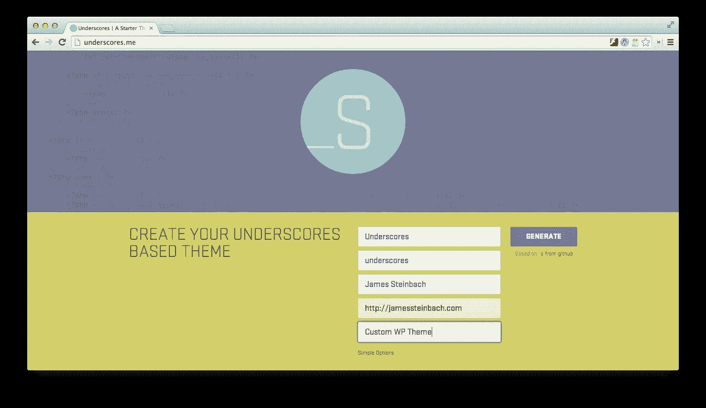
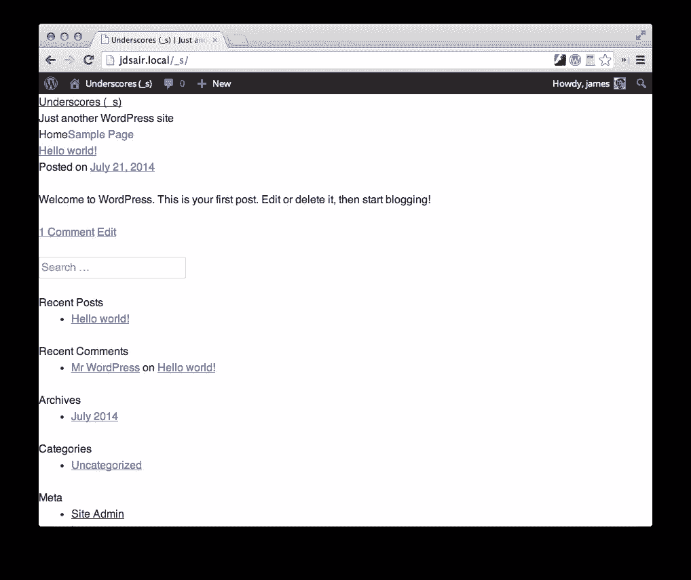
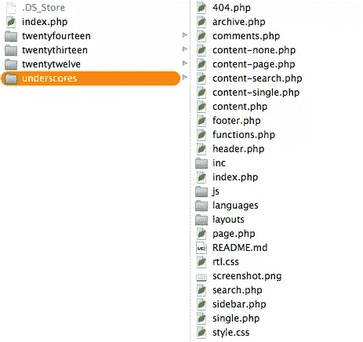

# WordPress 主题开发:下划线(_s)入门

> 原文：<https://www.sitepoint.com/wordpress-theme-development-getting-started-with-underscores/>

这篇文章是为构建定制 WordPress 主题的开发者准备的。有时候购买一个高级主题或者用一个子主题来修改它是可以的，但是在很多情况下，没有一个现有的主题能够精确地满足客户的内容需求或者正确地传达他们的视觉身份。

有许多有用的空白主题或开始主题可用于定制 WordPress 主题开发。比较常见的有[骨骼](http://themble.com/bones/)、[根](http://roots.io/starter-theme/)、[关节](http://jointswp.com/)、 [HTML5 空白](http://html5blank.com/)、 [HTML5 重置](http://html5reset.org/#wordpress)。这些主题具有不同级别的内置样式。有的靠[自举](http://getbootstrap.com/)；其他人用[粉底](http://foundation.zurb.com/)。一些包括一个 [CSS 复位](http://meyerweb.com/eric/tools/css/reset/)；其他的只是简单的包含 [normalize.css](http://necolas.github.io/normalize.css/) 。

我个人最喜欢的是 **_s** (也叫**下划线**)。这是一个空白主题，由经营 WordPress.com、Jetpack、Akismet 和 Gravatar 的公司[automatic](http://automattic.com/)维护。这确保了它与当前的 WordPress 代码标准保持一致。事实上，上个月仅[就有至少 30 条更新。](https://github.com/Automattic/_s/commits/master)

_s 不仅是 WordPress 标准的最新版本，也是 HTML5 标准的最新版本。使用像`<header>`、`<footer>`、`<nav>`、`<article>`和`<section>`这样的语义标签，它为搜索引擎尽可能准确地呈现你的内容。*注意:如果你关心 IE8 及以下版本的布局，在你的主题中加入 [html5shiv](https://github.com/aFarkas/html5shiv) 。*

我喜欢 _s 的另一点是它没有的东西。它没有网格系统、选项框架或 JavaScript 库。换句话说，它并不臃肿，我以后不得不修剪。它仅有的样式(除了重置和导航)是我选择添加的。我知道很多人依赖 CSS 框架来加速开发，但是我更愿意在开发上投入必要的时间来加速站点的速度！

## 下载和安装 _s

你可以在[underlines . me](http://underscores.me)下载 _s。该页面首先为您提供了一个字段:为您的主题选择名称。我建议点击“高级选项”链接，添加一个主题，作者姓名和网站，以及描述。这些值将被自动添加到 style.css 顶部的[主题评论](http://codex.wordpress.org/Theme_Development#Theme_Stylesheet)

你会得到一个包含你的主题文件的. zip 文件。使用 Dashboard-> Appearance-> Themes-> Add New-> Upload Theme 将它上传到您的站点，然后像平常一样激活它。它的截图只是一个方格图案。(当你生成主题时，我在高级选项中询问了上传你自己的 screenshot.png，但答案是否定的。)

## 基本造型

一旦你激活 _s，你会注意到的第一件事就是这是你见过的最无聊的主题。

一切都是你的基本 16px 无衬线。没有边距；没有太多填料；它几乎只是深灰色和蓝色。这是一件好事！这只是一个简单的基础，而不是一个客户端现成的模板。

## CSS 结构

_s 中的 style.css 文件组织良好，格式规范。它将风格分为 12 个部分:

1.  重置
2.  排印
3.  元素
4.  形式
5.  导航(链接和菜单)
6.  易接近
7.  对齐
8.  空地
9.  小工具
10.  内容(帖子和页面、旁白和评论)
11.  无限滚动(可选)
12.  媒体(标题和图库)

这样可以很容易地将你自己的风格添加到一个已经组织好的文件中。如果你想使用 Sass 或另一个 CSS 预处理器来维护你的自定义主题的 CSS，那么把这个文件分成几个部分也很简单([我会这么做](http://jamessteinbach.com/css/css-sass-wordpress/))。或者如果你喜欢，Github 上有[一些](https://github.com/sabreuse/sassy_s)[Sass](https://github.com/karmatosed/undersass)–[ready](https://github.com/MichaelArestad/th_s)[fork](https://github.com/WebDevStudios/_s/tree/sass)of _ s。

## 模板文件结构

_s 仔细遵循 [WordPress 模板文件命名约定](http://codex.wordpress.org/Template_Hierarchy)。您的基本模板文件是 index.php、archive.php、page.php 和 single.php。这些都使用 [`get_template_part()`](http://codex.wordpress.org/Function_Reference/get_template_part) 函数来调用适当的部分文件(如 content-page.php 或 content-single.php)。你也可以在 _s 中找到标准的 WordPress 文件，比如 header.php、footer.php 和 sidebar.php

这种整洁的组织系统为开发人员提供了一种可维护的模式。如果您要为一家公司添加一个名为 Staff 的自定义帖子类型，您需要创建 archive-staff.php 来显示所有员工，并为单个成员创建 single-staff.php。这些网页会要求 content-staff.php 提供内容。如果您需要为存档和单个调用不同的内容，您可以使用 content-staff.php 中的 [`is_post_type_archive()`](http://codex.wordpress.org/Function_Reference/is_post_type_archive) 条件测试来为不同的视图提供不同版本的内容。

## 结论

我强烈建议下次你需要从头开始开发一个定制主题时尝试一下。它是在 [GPL](http://en.wikipedia.org/wiki/GNU_General_Public_License) 下授权的，所以你可以自由地做你喜欢的事情，包括开发基于 _s 的商业主题。该主题代码清晰，符合现代标准，不包含臃肿的框架或风格。

如果你用了一个很棒的主题，或者有一个你喜欢的不同的空白主题，请在评论中告诉我们！

## 分享这篇文章