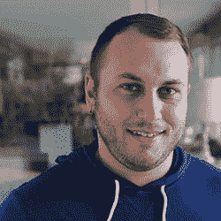
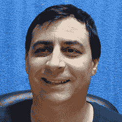
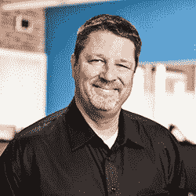

# 知名 PHP 社区成员的工作流程是怎样的？

> 原文：<https://www.sitepoint.com/workflows-prominent-community-members/>

工作流指的是流程和流程中使用的工具。几乎每个开发人员都有一个创建和最终确定项目可交付成果的过程。这个过程是通过一组工具实现的，这些工具是开发人员通过反复试验得出的。一旦一个工作流被完善，开发人员几乎虔诚地遵循这个过程，因为一个简单的原因:遵循工作流减少了开发人员在项目期间必须面对的大部分管理问题。

由于开发工作流是一件需要经验和反复试验的事情(这是一个非常令人苦恼的过程)，许多专家建议初露头角的开发人员应该尝试和研究其他已知开发人员的工作流。随着时间的推移，这些新的开发人员将会提出他们自己的项目开发工具包，因为他们会采纳对他们有用的东西，抛弃不有用的东西。

这里有一些 PHP 生态系统中最受欢迎的开发者和设计者，以及他们的工具和/或工作流程。请注意，这些工作流绝不是全面的，但即使提到我们社区中一些比较突出的成员所使用的工具，也应该足以保证对它们进行检查。

[Twitter](https://twitter.com/taylorotwell)|[Linkedin](https://www.linkedin.com/in/taylor-otwell-23794592/)|[GitHub](https://github.com/taylorotwell)

## 泰勒·奥特威尔，拉勒维尔的创造者

*   目前，Blackfire.io 是我最喜欢的分析 PHP 应用程序的工具。它提供了一个易于使用的界面和快速识别应用程序中有问题的部分的方法。

*   对于持续部署，我通常依赖于 [Forge](https://www.sitepoint.com/setting-up-php-7-servers-with-laravel-forge-and-digitalocean/) 和 [Envoyer](https://envoyer.io/) ，这是我自己创建的两个服务。

泰勒还在[这是 AMA 的作品](https://hashnode.com/ama/with-taylor-otwell-cilmj90zh000k6t53il0rdgqp)中深入讨论了他的工作流程——请查看以了解细节。

[Twitter](https://twitter.com/philsturgeon)|[Linkedin](https://www.linkedin.com/in/philipsturgeon/)|[GitHub](https://github.com/philsturgeon)

## 菲尔·斯特金，WeWork 的软件工程师

*   流浪者和 T2【Docker】帮助保持项目的包装和隔离，所以大多数时候如果依赖关系足够复杂，我会使用它们。

*   这些天，我主要在做**API**，所以很多时候，我只是拉下 [Git](https://www.sitepoint.com/premium/courses/introduction-to-git-2902/?aref=bskvorc) repo、 [composer](https://getcomposer.org/) install、`php -S`或者运行测试套件。

[Twitter](https://twitter.com/spriebsch)|[Linkedin](https://www.linkedin.com/in/stefanpriebsch/)|[GitHub](https://github.com/spriebsch)

## Stefan Priebsch，thePHP.cc 的 IT 顾问

*   我通常和 [PHPStorm](https://www.sitepoint.com/phpstorm-top-productivity-hacks-shortcuts/) 、 [PHPUnit](https://www.sitepoint.com/re-introducing-phpunit-getting-started-tdd-php/) 、 [phpab](https://github.com/phpab/phpab) 、 [PHP_Depend](https://pdepend.org/documentation/what-is-php-depend.html) 和 [PHP CodeSniffer](https://www.sitepoint.com/8-must-have-php-quality-assurance-tools/) 一起工作。

*   我最近开始使用一个有趣的新工具，名为[dep pend](https://github.com/mihaeu/dephpend)，这是一个非常有前途的依赖分析工具，可以检测架构违规。

*   当然，我使用 [Git](https://www.sitepoint.com/premium/courses/introduction-to-git-2902/?aref=bskvorc) 作为版本控制，使用 [Jenkins](https://www.sitepoint.com/re-introducing-jenkins-automated-testing-with-pipelines/) 进行持续集成，尽管我通常不会为我的私人项目设置 CI 服务器。

[Twitter](https://twitter.com/nicolasgrekas)|[Linkedin](https://www.linkedin.com/in/nicolasgrekas/)|[GitHub](https://github.com/nicolas-grekas)

## Nicolas Grekas，首席技术官 Blackfire.io

*   在硬件方面，我用的是一台漂亮的富士通笔记本电脑，有两个额外的屏幕(我的笔记本电脑有三个屏幕，但我通常使用其中的两个。)

*   软件方面，我用的是 **Ubuntu** ， [Git](https://www.sitepoint.com/premium/courses/introduction-to-git-2902/?aref=bskvorc) ， [vim](https://www.sitepoint.com/getting-started-vim/) ，一个终端，一个浏览器。

*   我有时也使用 [qgit](https://apps.ubuntu.com/cat/applications/precise/qgit/) ，用崇高的文字写作，并有一个 **Windows VM** 来调试那里的问题(是的， **Blackfire** 也在 Windows 上工作！)或在上使用 PowerPoint。

*   我可能是错的，但我倾向于认为我的开发经验中最慢的部分是我的大脑，所以我不觉得需要一个花哨的 IDE。

*   Docker Compose 用于本地引导 Blackfire 堆栈，以及最近即将公开发布的 [SensioCloud](https://sensio.cloud/) ，将基础架构设置简化为简单的端口隧道。

*   在项目/质量管理方面，我们使用 Github、 [Splitsh](https://github.com/splitsh) 、 [Jenkins](https://www.sitepoint.com/re-introducing-jenkins-automated-testing-with-pipelines/) 、 [Appveyor](https://www.appveyor.com/) 、 [Zendesk](https://www.zendesk.com/) 、[吉拉](https://jira.atlassian.com/)、 [Slack](https://slack.com/) 以及其他一些工具。

[Twitter](https://twitter.com/adamwathan)|[Linkedin](https://www.linkedin.com/in/adam-wathan-9418984a/)|[GitHub](https://github.com/adamwathan)

## 亚当·瓦森，软件企业家和作家

以下是我最喜欢的一些:

*   27 英寸 5K**iMac**用于我 99%的工作

*   13 英寸 Retina**MacBook**Pro，适合我在旅途中工作时使用

*   [升华所有开发工作的文本 3](https://www.sitepoint.com/10-essential-sublime-text-plugins-full-stack-developer/)

*   [Sequel Pro](https://www.sequelpro.com/) 用于使用 MySQL 数据库

*   [航空邮件](http://airmailapp.com/) [邮件](http://airmailapp.com/) 3

*   记录我需要完成的事情

*   以 ZSH 为终点站的 iTerm 3

*   Github 托管我所有的存储库

*   Laravel [Forge](https://www.sitepoint.com/setting-up-php-7-servers-with-laravel-forge-and-digitalocean/) 用于供应服务器

*   [Envoyer](https://envoyer.io/) 实现零停机部署

[Twitter](https://twitter.com/manuellemos)|[Linkedin](https://www.linkedin.com/in/manuellemos/)|[GitHub](https://github.com/manuellemos)

## Icontem 和 phpclasses.org 的创始人曼努埃尔·莱默斯

自 2006 年以来，我使用用例映射来标准化我的 PHP 项目开发:

*   我的每个项目分为**个子系统**如:博客系统、论坛系统、群发邮件系统、社交网络系统、游戏化系统等..

*   每个子系统都由用例(用户故事)类组成，它们的作用就像[控制器](https://www.sitepoint.com/front-controller-pattern-1/)。它们处理 [HTTP 请求](https://www.sitepoint.com/from-http-messages-to-psr-7-whats-it-all-about/)或其他类型的输入，调用服务类来执行像访问数据库或**远程系统这样的操作。**

*   对于数据库访问，我使用一个叫做[元存储](http://www.meta-language.net/metastorage.html)的 ORM 代码生成工具，它是我从 2002 年开始开发的。它从一个 **XML** 文件中获取一个对象关系定义，并为 PHP 类生成代码以访问每个类对象的数据。

*   该工具生成最终代码，即生成后不需要编辑的代码。它还生成数据库模式定义文件，允许安装和升级数据库模式，而无需进一步考虑更新模式所需的确切 SQL 语句。

如今，我 50%的 PHP 项目代码由**元存储**生成是很正常的。这意味着它使我更有效率，用更少的工作获得更多，并使用更可靠的代码，因为元存储生成类型检查代码。

[推特](https://twitter.com/codeguy) | [GitHub](https://github.com/codeguy)

## Josh Lockhart，Slim Framework 和 PHP 的创始人

*   我使用[流浪者](https://www.sitepoint.com/re-introducing-vagrant-right-way-start-php/)为每个项目管理一个唯一的 **Ubuntu** 虚拟机。

*   我为每台虚拟机和我的生产服务器配置相同的[责任](https://www.ansible.com/)角色，以确保两个环境完全相同。

*   我更喜欢用 [PHPStorm](https://www.sitepoint.com/phpstorm-top-productivity-hacks-shortcuts/) 来写代码。

*   我在 99.999%的项目中使用 [Composer](https://www.sitepoint.com/re-introducing-composer/) 。

*   我用 [PHPUnit](https://www.sitepoint.com/re-introducing-phpunit-getting-started-tdd-php/) 编写并运行测试。

*   版本控制是通过 **GitLab** 完成的，这反过来会触发对 [CodeShip](https://www.sitepoint.com/sailing-parallel-seas-codeship/) 或 [Travis CI](https://www.sitepoint.com/php-continuous-integration-travis-ci/) 的持续测试。

*   我管理 Capistrano 的部署。这是一个坚实的工作流程，已经花了几年时间去发现和完善。但我对自己的现状非常满意。

*   Docker 很诱人，但我不相信它已经成熟到让我可以在生产中轻松使用和管理它。

[Twitter](https://twitter.com/eryno)|[Linkedin](https://www.linkedin.com/in/erynoneil/)|[GitHub](https://github.com/eryno)

## Eryn O'Neil，议长兼顾问

我从事许多不同的项目，其中大部分是由别人而不是我启动的。在我的开发工作流程中，很多事情会随着项目的不同而变化。然而，以下事情总是(或大部分)一致的:

*   我用的是一台**戴尔**开发者版 13”XPS 配 **Ubuntu** 。(开发人员版本安装了 Ubuntu，戴尔保证提供驱动程序支持。我也依靠我的便携式栖息支架和外接键盘&鼠标。

*   软件方面，我在 [vim](https://www.sitepoint.com/getting-started-vim/) 的 Ubuntu 上开发。我有一辆**。vimrc** 和一些让生活更简单的插件。

*   我使用[流浪者](https://www.sitepoint.com/re-introducing-vagrant-right-way-start-php/)来分隔我的本地开发环境。 [Scotch Box](https://box.scotch.io/) 是一种惊人的开箱即用的流浪体验，它帮助我在无法访问开发环境或现有 VM 的情况下快速开始新项目。

*   我管理有 GitHub 问题的项目和它们的新项目特性(基本上是与你的 Github 库集成的 **Trello 风格的**板)。对于更高层次的项目管理，我使用 Insightly 来保持一切正常。

[Twitter](https://twitter.com/CalEvans)|[Linkedin](https://www.linkedin.com/in/calevans/)|[GitHub](https://github.com/calevans)

## Cal Evans，运行 Nomad PHP，elePHPant

我的新项目工作流程通常遵循这种模式。

*   打开 [Sublime Text](https://www.sitepoint.com/10-essential-sublime-text-plugins-full-stack-developer/) ，写 20-40 行程序性的 **PHP** ，看看这个想法是否可行。

*   如果需要数据库，我就设计数据库。并非所有项目都需要数据库。即使像配置选项这样的信息需要持久化，很多时候一个简单的配置文件就足够了。对于数据库设计，我坚持使用 MySQL work bench。多年来，它一直是我的首选工具。

*   浏览工作流程:如果我为项目设计了一个数据库，那么这一步大部分已经完成了。如果没有，我会遍历工作流。有时候我会画出来，其他时候，我只是开始列出我认为我会需要的物品。我通常过度设计，只使用我列出的对象的 1/2。如果这是一个 **API** ，我会列出所有我认为需要的端点。如果是网站，我会列出页面。大多数时候，这是一个 **CLI** 项目，我从我需要的命令开始。因为我对所有事情都使用 symfony/command，所以这是一个很好的起点。

*   构建一个命令

    *   构建命令并使其工作。

    *   将流程中发现的任何新对象分解成离散的对象

    *   为命令编写[单元测试](https://www.sitepoint.com/re-introducing-phpunit-getting-started-tdd-php/)

    *   承诺回购

*   关于**单元测试**的一句话。如果这是一个只有我会使用的项目，不，我通常不写单元测试。如果有其他人会参与，是的，我写他们。我通常争取 70%-80%的代码覆盖率。

*   关于存储库，是的，几乎我最近构建的每个项目都在源代码控制之下。同样，如果只有我一个人和其他人一起工作，我的工作流程会有所不同。如果只有我，如果这是一个新项目，我通常会在主分支工作，如果是现有项目的迭代，我通常会在新分支工作。如果其他人和我一起工作，我通常采用特征分支。

*   迭代直到成功:注意我没有说“直到完成”。我做过的每个项目都是不完整的。我总是可以添加一些东西，新功能，新选项，重构，我问我的一个艺术家朋友“你什么时候知道它完成了？”他回答说，艺术永远不会结束。我的代码没有上升到艺术的层面，但我认同其中的感悟。

    这就是我的工作方式。我不可或缺的工具是:

*   [作曲家](https://www.sitepoint.com/re-introducing-composer/)

*   [PHPUnit](https://www.sitepoint.com/re-introducing-phpunit-getting-started-tdd-php/)

*   [去](https://www.sitepoint.com/premium/courses/introduction-to-git-2902/?aref=bskvorc)

*   [崇高正文 3](https://www.sitepoint.com/10-essential-sublime-text-plugins-full-stack-developer/)

*   MySQL 工作台

*   码头工人

*   用于 API 的精简框架

*   网站 WordPress

*   其他一切的 Symfony/console

[Twitter](https://twitter.com/kasiazien)|[Linkedin](https://www.linkedin.com/in/katzien/)|[GitHub](https://github.com/katzien)

## Kat Zien，Brightpearl 的高级软件开发人员

我的开发工作流程非常标准。

*   我使用[特雷罗](https://trello.com/)或 **github/gitlab** 问题进行规划。我根据我正在做的事情使用一些编辑器。 [Vim](https://www.sitepoint.com/getting-started-vim/) 如果是 bash 或者只是快速编辑一些东西。

*   [PHPStorm](https://www.sitepoint.com/phpstorm-top-productivity-hacks-shortcuts/) 代表 PHP， [Gogland](https://www.jetbrains.com/go/) 代表[Go](https://golang.org/)——多年来一直愉快地使用着 [JetBrains](https://www.jetbrains.com/) 家族。

*   我最近开始使用微软的 [VSCode](https://code.visualstudio.com/) 用于 Go 或者 **bash 脚本**，到目前为止我真的很喜欢它。

*   至于技术，我试着做 TDD，但如果我说我总是这样做，那我是在撒谎。有时候，如果我在做一些探索性的工作，我会跳过测试，一头扎进去，然后再担心重构和测试。

*   不过，我确实喜欢测试我的代码，所以对于较长的项目，我会让[詹金斯](https://www.sitepoint.com/re-introducing-jenkins-automated-testing-with-pipelines/)或[特拉维斯 CI](https://www.sitepoint.com/php-continuous-integration-travis-ci/) 为我运行测试和代码覆盖。

*   如果我写 **Go** ，我也会写一些基准测试来确保我的代码运行良好。Go 内置了很多很棒的工具，比如竞争检测器或运行时分析器，所以我通常会在做项目时使用它们。

我喜欢通过拉请求来贡献我的代码，不管是个人项目还是工作，所以我的工作流程基本上就是基于此。创建一个请求，让它的代码被审查，合并，然后测试运行，它进入我们的连续交付管道。除非是一次性的简单项目，否则尽可能自动化是关键！:)

[推特](https://twitter.com/laurium) | [领英](https://www.linkedin.com/in/laurium/)

## Laura Elizabeth，客户门户和设计学院的创建者

我是一名设计师，我的合作伙伴是一名开发人员(我们都是企业主)，所以我们的工作流程非常协作。

*   我们在纸上做我们的计划，并使用[俱乐部](https://clubhouse.io/)来组织我们的待办事项。

*   我的合作伙伴将开始编写基本结构，包括填充内容，而我则跳进 Photoshop，开始模拟一些视觉效果。

*   我们使用分形来定义组件，并开始设计一些核心组件，如按钮或可以重复使用的特定模块。

*   我们使用 [Atom](https://atom.io/) 进行编辑，使用 [BitBucket](https://bitbucket.org/) 进行开发。

*   对于我们的一个应用程序(http://rightmessage.io)，我们使用的是 Laravel :-)，其他的是简单的 WordPress 网站或插件。

## 结论

从上面的列表来看，一些工作流程的思路非常清晰:

*   Linux 是首选的开发环境。开发人员确实使用 Windows 或其他操作系统，但仅用于测试和应用程序兼容性验证。

*   开发人员喜欢用 Docker 和 vagger 来管理他们的项目。

*   詹金斯和 特拉维斯·CI 是管理 GitHub 和 GitLab 持续部署的推荐工具

*   Git 在版本控制方面一致胜出，大多数人喜欢进行[测试](https://www.sitepoint.com/re-introducing-phpunit-getting-started-tdd-php/)，但不会为个人项目编写测试。

*   ide 和代码编辑器的选择是非常个人化的，从简单的文本编辑器到现代的文本编辑器，再到完整的 ide。然而，当它是一个 IDE 时，付费的 PHPstorm 似乎比 Netbeans 之类的免费替代品更受欢迎。

你的工作流程有哪些细节？你在这些开发人员中找到共同的工作流程基础了吗？让我们知道你的开发过程采用了什么方法，也许我们会带着没有人听说过但应该拥有的工具的最终列表离开！

## 分享这篇文章