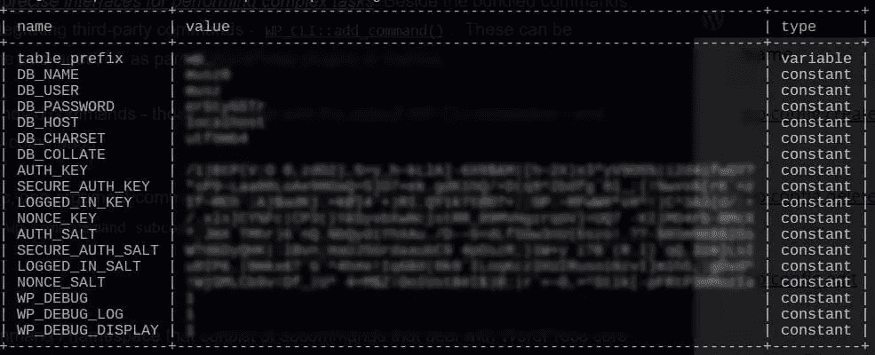
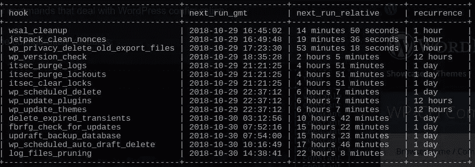
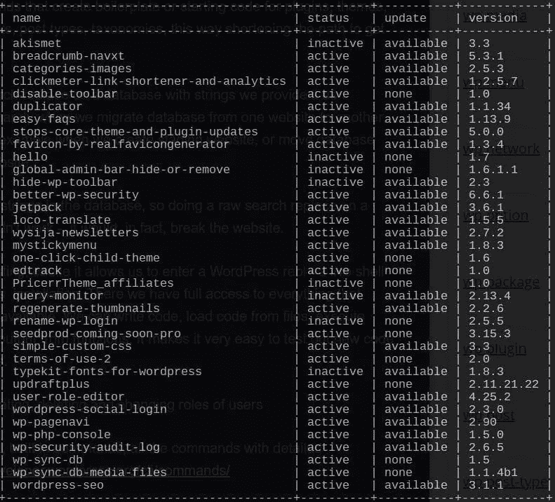

# 用 WP-CLI 管理 WordPress 的入门指南

> 原文：<https://www.sitepoint.com/wp-cli-introduction/>

这篇文章提供了一个 WP-CLI 的介绍性指南，这是一个命令行工具，它的创建是为了让开发者的生活更容易，允许他们通过命令行而不是通过通常的管理界面来管理 WordPress 站点。

WP-CLI 是由丹尼尔·巴赫胡伯在十多年前创建的。从那时起，它已经成为每一个高级 WordPress 开发者的武器库中不可或缺的工具——根据[马特·莫楞威格](https://make.wordpress.org/core/2016/12/28/supporting-the-future-of-wp-cli/)的说法，“几乎每一个 WordPress 的主要用户都部署和依赖它”。自 2016 年起，WP-CLI 成为[官方 WordPress CLI 工具](https://make.wordpress.org/cli)。

WP-CLI 用于安装和设置一个 WordPress 网站，改变它的选项，管理用户，以及许多其他事情。它可以用来显著加快开发人员的工作流程。

WP-CLI 是一个`phar`文件 PHP Archive 的缩写。它是将多个 PHP 文件和其他资源打包成一个应用程序的标准——为了更简单的分发和安装。

## 装置

显然，WP-CLI 假定我们可以访问系统外壳。这在 Linux 和 macOS 系统上非常简单——特别是在服务器上——因为 WordPress 几乎普遍在 Linux 机器上提供服务。如果我们有专门的服务器托管，或者像 AWS，阿里云等云托管。或者，如果我们使用 Digital Ocean、Vultr、Linode 等公司的 VPS，SSH 是默认的访问选项，但现在许多共享主机都提供 SSH 访问选项。(有些甚至预装了 WP-CLI。)

对于 Windows 用户来说，WP-CLI 可以通过 Composer 安装[，但是我们建议读者先熟悉一下](https://make.wordpress.org/cli/handbook/installing/#installing-on-windows) [Windows 子系统 for Linux](https://docs.microsoft.com/en-us/windows/wsl/install-win10) ，因为它可以提供一个原生的 Linux 环境，以及 Bash、APT 之类的包管理器等等。WordPress 是一款 PHP app，PHP 的原生环境是 Linux。

更多的代码示例假设我们使用的是 Linux 或 Unix 类型的系统。

为了获取 WP-CLI phar 归档文件，我们使用了`usecurl`或`wget`:

```
curl -O https://raw.githubusercontent.com/wp-cli/builds/gh-pages/phar/wp-cli.phar 
```

这会将我们的归档文件下载到当前目录。然后我们使它可执行:

```
chmod +x wp-cli.phar 
```

然后我们移动它，使它作为一个`wp`命令可用:

```
sudo mv wp-cli.phar /usr/local/bin/wp 
```

现在我们有了一个可用的`wp`命令:

<video class="wp-video-shortcode" id="video-169938-5" width="600" height="0" preload="metadata" controls=""><source type="video/mp4" src="https://uploads.sitepoint.com/wp-content/uploads/2018/11/1541465872wp.mp4?_=5">[https://uploads.sitepoint.com/wp-content/uploads/2018/11/1541465872wp.mp4](https://uploads.sitepoint.com/wp-content/uploads/2018/11/1541465872wp.mp4)</video>

现在，在输入`wp`命令后，它会为我们显示所有选项，以及可能的参数。一个警告:如果我们作为根用户运行，我们需要在命令中添加`--allow-root`:


现在我们已经设置好了，我们可以探索命令和可能的使用场景。

## WP-CLI 命令

WP-CLI 旨在为 WordPress web 管理界面提供一个快速的替代方案。有大量代码或功能为执行复杂任务提供了简单、精确的接口。除了捆绑的命令之外，WP-CLI 还定义了一个用于集成第三方命令的 API—[。这些既可以作为独立的包分发，也可以作为 WordPress 插件或主题的一部分。](http://wp-cli.org/docs/internal-api/wp-cli-add-command/)

在本指南中，我们将回顾捆绑命令(默认 WP-CLI 安装附带的命令)和一些更值得注意的第三方命令。

命令可以是基本的单参数命令，如`wp somecommand`，也可以是基本命令名称空间下的子命令，如`wp somecommand subcommand`。

### wp 核心

`wp core` *子命令*是一个命令/名称空间，由处理 WordPress 核心的命令组成——因此我们可以下载、安装、更新、转换到 multisite 并获得关于我们的 WordPress 核心版本的信息:

*   `wp core download`将 WordPress 的最新版本下载到当前目录
*   `wp core install`运行标准的 WordPress 安装过程，选项有`--url=somewebsite.com`、`--title=SomeWebsite`、`--admin_user=someusername`、`--admin_password=somepassword`和`--admin_email=some@email.com`
*   `wp core multisite-install`安装一个新的多站点 WordPress 安装，并且`wp core multisite-convert`将一个常规安装转换成多站点。
*   `wp core update`会将 WordPress 更新到一个较新的版本，`wp core update-db`会更新数据库。

关于 **wp 内核**的更多细节可以在[文档](https://developer.wordpress.org/cli/commands/core/)中找到。

当我们在 Bash 脚本中组合它的命令时，WP-CLI 真的大放异彩，所以我们可以将`wp core download`和`wp core install`组合成一个 Bash 命令，并简化安装。

这里值得注意的是，在运行安装之前，我们需要创建一个`wp-config.php`文件，其中包含安装所需的数据库凭证和其他详细信息。

WP-CLI 为此提供了一个`wp config create`命令。

### wp 配置

是处理 WordPress 配置的命令的名称空间。

*   `wp config list`列出了所有的配置变量:

    

*   `wp config create`——如我们所说——用我们提供的变量创建配置文件，如`wp config create --dbname=somedb --dbuser=someuser --dbpass=somepass`和其他变量，如文档中概述的

*   `wp config get`(例如，`wp config get table_prefix`)从 wp-config.php 获取特定的配置变量

*   类似地，`wp config set`设置配置变量

更多的`wp config`细节可以在[这里](https://developer.wordpress.org/cli/commands/config/)找到。

wp cap 对于管理用户角色和能力很有意思。我们可以添加和删除特定角色的功能。

[wp cron](https://developer.wordpress.org/cli/commands/cron/) 是一个命令命名空间，用于测试、运行和删除 WP-Cron 事件。例如，`wp cron event list`会给出类似这样的输出:



然后我们可以删除类似于`wp cron event delete wsal_cleanup`的事件——或者重新安排它们，等等。

有时候，在更新内容、开发、修改的过程中，我们会发现刷新 WordPress 页面并不会显示我们所做的修改。很多时候，这导致了疯狂的搜索，试图找到我们做错了什么。

通常是缓存问题。默认情况下，WordPress 对象缓存是不持久的，所以当使用跨请求持久化对象缓存的插件时，清理对象缓存的需求会加剧(通常就是这样)。

wp 缓存是一个名字空间，包含处理 WP 对象缓存的命令。

`wp cache flush`是刷新整个缓存的命令。这是一个显而易见的命令——一个简单、常用的命令，不需要任何其他参数，并从缓存中清除所有内容。

`wp cache`还包含其他命令，可用于高速缓存项目的原子管理。

`wp cache add`、`wp cache delete`、`wp cache get`、`wp cache set`、`wp cache replace`等命令可以列出、检查、添加、更改或删除对象缓存中的特定值。

WordPress 瞬态是 WP 缓存策略的另一个元素，默认情况下是持久的，并且可以在 WordPress 的整体性能中发挥作用。很多插件大量使用 WordPress 瞬态，这会使网站变得混乱和缓慢，这种情况并不是没有听说过。

wp 瞬态名称空间包含删除、获取或设置瞬态的命令。

WordPress 缓存系统中另一个有时需要刷新的元素是 WordPress 的永久链接。

[wp 重写](https://developer.wordpfress.org/cli/commands/rewrite/)——特别是`wp rewrite flush`——使得刷新重写规则(永久链接)成为可能。我们还可以列出重写规则。

wp db 包含管理 WordPress 数据库的命令。洞察、修复、优化、搜索、各种查询。我们还可以导出或导入数据库。

wp 评估文件和 [wp 评估文件](https://developer.wordpress.org/cli/commands/eval-file/)可以用来在我们的 WordPress 安装环境中执行一些代码。

[wp 导出](https://developer.wordpress.org/cli/commands/export/)和 [wp 导入](https://developer.wordpress.org/cli/commands/import/)导出和导入 WXR 格式的内容。

wp 选项包含管理、获取和设置 WordPress 选项的命令。

wp scaffold 包含为插件、主题、子主题、Gutenberg 块、文章类型、分类法创建样板或起始代码的命令——从而缩短了它们运行的路径。

wp search-replace 在数据库上搜索替换我们作为参数提供的字符串。当我们将数据库从一个网站迁移到另一个网站，并需要更改 URL 时，这非常方便。例如，当我们创建一个临时网站，或者将数据库从临时网站移动到生产网站时。

WordPress 在数据库中序列化内容字符串，所以在一些编辑器中对数据库进行原始搜索-替换是行不通的；事实上，这会破坏网站。

wp shell 特别有趣，因为它允许我们进入 WordPress repl——一个 WordPress 安装的实时 shell 环境。在那里，我们可以完全访问一些活动插件的所有内容。我们可以编写代码，从文件中加载代码，执行函数，观察或检查函数的输出。它使得测试新代码变得非常容易，而不需要浏览器刷新周期。

[wp 用户](https://developer.wordpress.org/cli/commands/user/)用于管理、更新、删除和改变用户的角色。

这些是一些默认的内置命令。所有命令的详细文档可以在 [WordPress 开发者文档](https://developer.wordpress.org/cli/commands/)中找到。

wp 插件可以列出、安装、激活、停用和删除插件，还可以编写脚本自动批量安装多个插件。可能会给我们这样的输出:



wp 主题也是这样，只针对主题。

[wp 包](https://developer.wordpress.org/cli/commands/package/)是管理 WP-CLI 包的命令命名空间。通过`wp package install somepackagename`，我们可以安装添加到 [WP-CLI 包索引](http://wp-cli.org/package-index/)中的第三方包。一些值得注意的包/命令有: [wp usergen cli](https://github.com/alessandrotesoro/wp-usergen-cli) ，创建随机用户进行测试；[数据库检查点](https://github.com/binarygary/db-checkpoint)，创建数据库快照；WP-CLI buddypress ，其中包含一些 buddypress 相关的命令； [WP-CLI size](https://github.com/petenelson/wp-cli-size) ，显示数据库和表的大小； [wp 钩子](https://runcommand.io/wp/hook/)，显示为特定过滤器或动作钩子注册的回调函数；[查询调试](https://runcommand.io/wp/query-debug/)，调试查询的性能；以及 [faker](https://github.com/trendwerk/faker) ，它帮助我们创建用于开发目的的填充职位。

社区还维护着许多其他的包/命令。完整的列表可以在这里找到。

## 结论

在本指南中，我们介绍了 WP-CLI 并涵盖了它的主要命令。我们还介绍了它的一些第三方包，但这绝不是完整的参考。有了 WP-CLI，使用的可能性和场景实际上是无限的。

## 分享这篇文章