# 在 Photoshop 中给你的主题加上炫目的效果

> 原文：<https://www.sitepoint.com/wrap-dazzling-effects-around-your-subject-in-photoshop/>

Photoshop 因修图、色彩校正和图像编辑等基本用途而闻名于世，但那些充分利用 Photoshop 多功能性的人几乎可以用它创建任何效果。创造明亮耀眼的效果可以将一张相当平凡的照片变成一个引人注目的设计。这些设计出现在专辑、海报、杂志和其他印刷品或网络上。

在 Photoshop 中创建发光、耀眼的效果时，最大的挑战之一是让它们看起来逼真。很难让它们看起来像是属于图像的一部分，但是通过一些技巧，你可以在你的对象周围加上一些效果，让它们真正突出。

下图可以在这里找到[。这张图片已经很有趣了，但是我们可以通过添加一些简洁的效果来给它添加我们自己的旋转。首先，我们需要提取主题，并将它们放在自己的层上。](http://www.sxc.hu/browse.phtml?f=download&id=993066)

为此，请选择快速选择工具，然后单击并拖动人物进行选择。按住 shift 键并添加到选择中，直到选择了整个几何体。接下来，选择“细化边缘”并选择“智能半径”选项。一路提升“智能半径”，然后选中“净化颜色”选项，一路提升该值。用图层蒙版设置输出为新图层，点击“确定”

(注:关于这些选择技术的更多信息，请查看[在 Photoshop 中制作复杂选择](https://www.sitepoint.com/making-complex-selections-in-photoshop/ "Making Complex Selections in Photoshop")和[在 Photoshop 中掌握复杂选择](https://www.sitepoint.com/mastering-complex-selections-in-photoshop/ "Mastering Complex Selections in Photoshop")。)

你会注意到，如果你仔细看，对象的部分皮肤是透明的。在这一点上，你真的看不到图像的细节，但是下面的技巧将适用于这个图像。点击 Command/Ctrl+“J”复制图层几次(4-5 次)。你可以点击 Command + "E "将当前层合并到它下面的一层，所以从你的副本堆的顶部开始。Photoshop 会询问您是要保留蒙版还是在合并前应用蒙版。选择您想要应用它。如果你不这样做，你会得到和开始时一样的结果。

我们想消除图像上的橙色色偏。我们可以点击“新建填充或调整图层”图标，然后选择“色调/饱和度”向左或向右移动色调滑块，直到色调变为冷蓝色。

[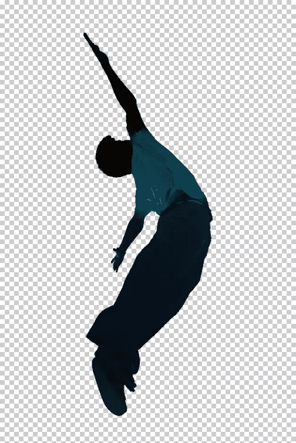](https://www.sitepoint.com/wp-content/uploads/2012/09/Screen-Shot-2012-09-05-at-1.08.29-AM.png)

接下来，我们可以在我们的主题后面放置一个背景。在人物图层下面新建一个图层，填充黑色。接下来，用纹理填充背景，你几乎可以在网上任何地方找到它。我选择了一个黑暗，肮脏的背景，并改变纹理层的不透明度为 10-15%。

[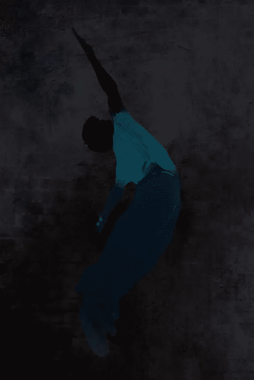](https://www.sitepoint.com/wp-content/uploads/2012/09/Screen-Shot-2012-09-05-at-1.12.00-AM.png)

如果主体在背景的衬托下看起来太暗也没关系；我们将添加一些效果来突出我们的主题。选择钢笔工具，并开始绘制一条波浪线来回超过我们的主题，应该看起来像下面的例子。

[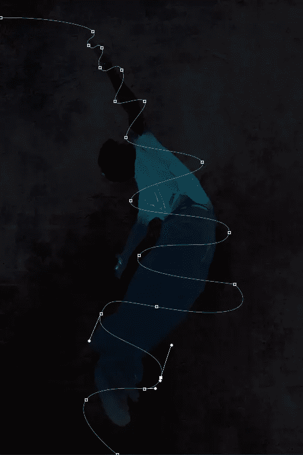](https://www.sitepoint.com/wp-content/uploads/2012/09/Screen-Shot-2012-09-04-at-10.14.36-PM.png)

当使用钢笔工具时，在任何你想要有曲线的地方，放置一个点。然后，您可以控制曲线的轮廓，以匹配您的主题，方法是使用直接选择工具来拖动和优化线条内的每条曲线。满意后，双击“路径”面板中的路径，保存路径，并将其命名为您稍后会认出的名称。每次创建单独的彩色光束时，您都需要这样做，以防您想要返回并添加增强光束的效果，并遵循相同的路径。接下来，点击画笔工具，调出你的画笔选项。

[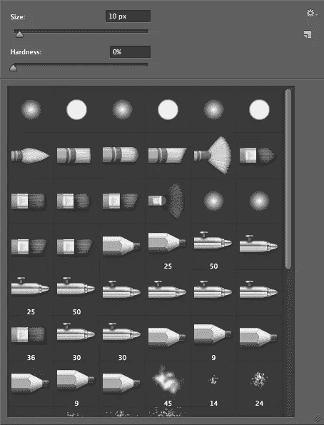](https://www.sitepoint.com/wp-content/uploads/2012/09/Screen-Shot-2012-09-05-at-1.29.55-AM.png)

选择一个大小在 5 到 10px 之间的软边笔刷。重要的是笔刷要有柔和的边缘，这样发光效果才能发挥作用。在所有其他层之上创建一个新层。确保我们的路径在“路径”面板中处于活动状态，确保笔刷工具在“工具”面板中的软边缘笔刷处于活动状态。在“路径”面板中，单击第二个图标，称为“画笔描边路径”

[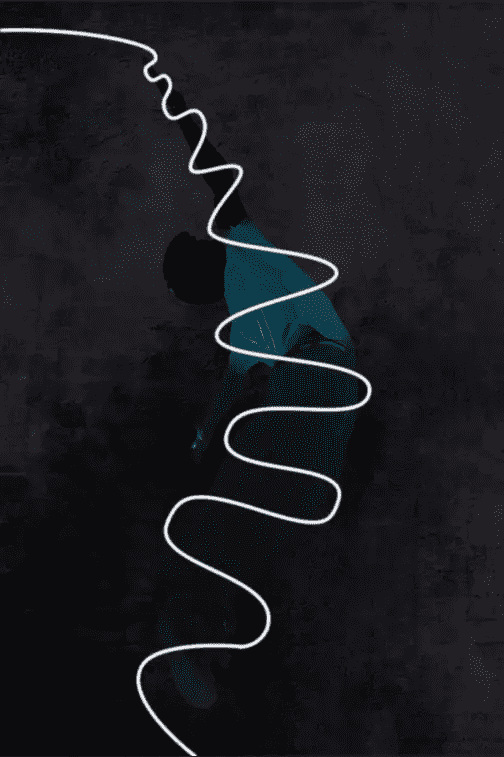](https://www.sitepoint.com/wp-content/uploads/2012/09/Screen-Shot-2012-09-05-at-1.37.48-AM.png)

添加发光效果就像添加图层样式一样简单，因为我们是在白色图层上工作。双击图层，调出“图层样式”选项。点击“内发光”，设置颜色为亮蓝色，设置混合模式为“强光”因为我们的笔刷只有大约 5 到 10px 的大小，我们想确保我们的内部发光只有大约 2 到 3px，所以发光线的中心是白色的，这使得看起来更真实。

[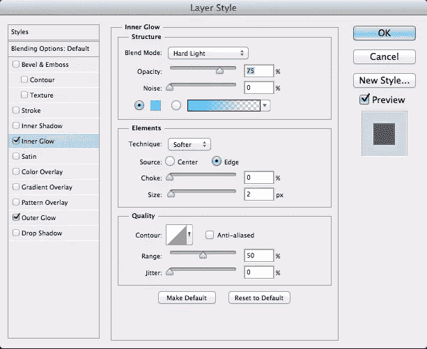](https://www.sitepoint.com/wp-content/uploads/2012/09/Screen-Shot-2012-09-05-at-1.36.40-AM.png)

接下来选择“外发光”，选择和之前一样的蓝色。选择“强光”作为你的混合模式，设置扩散为 0，但是将大小提高到 10px 左右。这将创造一个充满活力的光芒，这就是我们正在寻找的。单击“确定”

[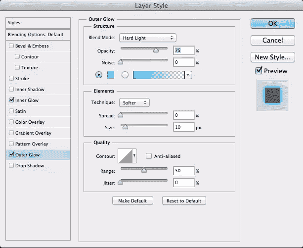](https://www.sitepoint.com/wp-content/uploads/2012/09/Screen-Shot-2012-09-05-at-1.37.20-AM.png)

到目前为止，你的发光效果应该是这样的:

[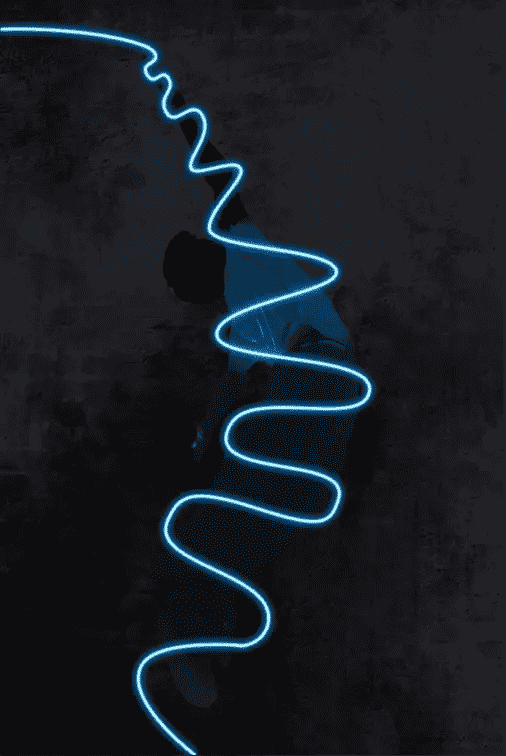](https://www.sitepoint.com/wp-content/uploads/2012/09/Screen-Shot-2012-09-05-at-1.48.10-AM.png)

在这一点上，我们只是有一个辉光效果，看起来像是画在我们的图像之上。它看起来不是真正的集成，但有了一个面具，我们可以快速轻松地解决这个问题。创建蒙版最简单的方法是找到人物所在的图层(之前我们已经将他从背景中提取出来),然后加载身体的形状作为选区。按住 Command/Ctrl 键单击图层预览图标，将身体形状作为选择加载。加载后，通过单击激活发光效果层，然后单击图层面板底部的图层蒙版图标。

[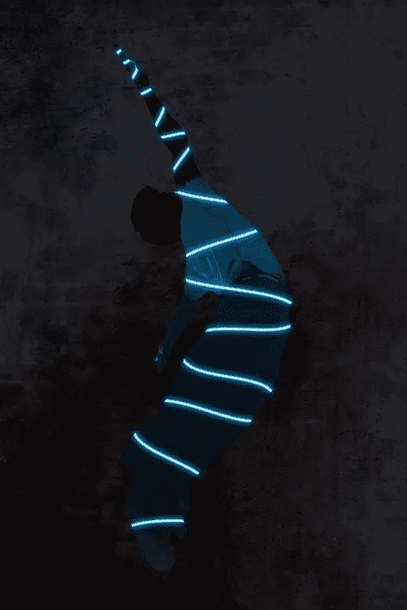](https://www.sitepoint.com/wp-content/uploads/2012/09/Screen-Shot-2012-09-05-at-1.53.48-AM.png)

这与我们想要的效果相反，所以点击这个图层的图层蒙版图标，然后按 Command/Ctrl+ "I "来反转蒙版。下面的结果比较好，但是我们还有一点工作要做。

[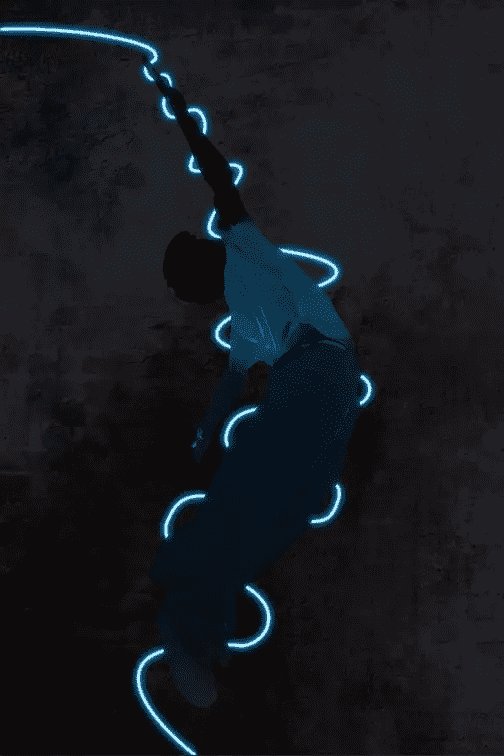](https://www.sitepoint.com/wp-content/uploads/2012/09/Screen-Shot-2012-09-05-at-1.54.04-AM.png)

在遮罩仍处于活动状态的情况下，选择比光束本身稍大的笔刷，并选择白色以显示光晕。交替你用刷子刷回的带子，这将使你的主体看起来有一束光在他周围盘旋。刷入一束，跳过下一束，刷入下一束，等等。您最终应该会得到类似于以下示例的结果。

[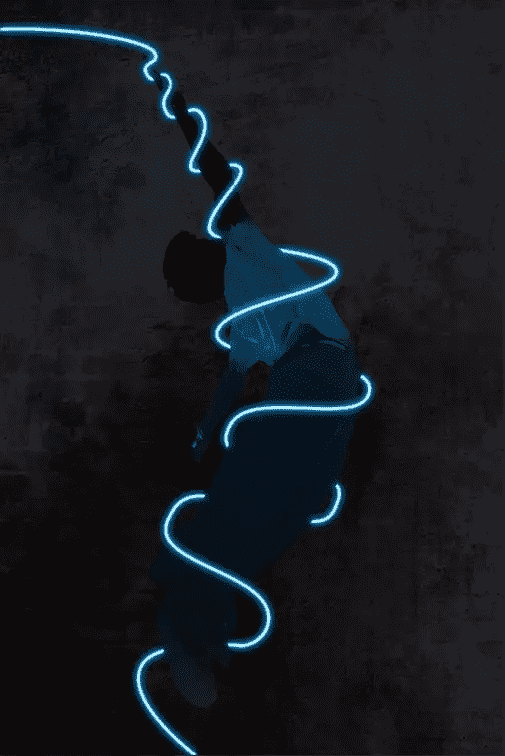](https://www.sitepoint.com/wp-content/uploads/2012/09/Screen-Shot-2012-09-05-at-2.01.32-AM.png)

再次重复整个过程，但这次使用与蓝色形成鲜明对比的不同颜色，如橙色。编织身体内部和外部的效果，刷在某些区域和掩盖其他区域。尝试整合另一只手臂，并将其融入橙色光束的布局中。

[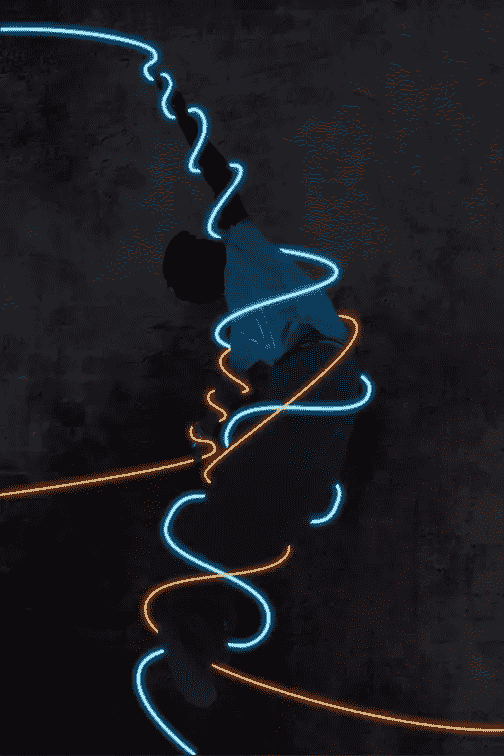](https://www.sitepoint.com/wp-content/uploads/2012/09/Screen-Shot-2012-09-05-at-3.07.04-AM.png)

到目前为止，这个效果很有趣，但是我们可以通过创建我们自己的自定义笔刷来添加粒子到我们的发光效果中，使它变得更好。选择笔刷工具，选择硬度为 0%的默认软边笔刷。打开“画笔”面板，为自定义画笔选择不同的设置。选择“画笔笔尖形状”，将大小增加到 215 像素左右，将间距增加到 120%左右。您可以在面板底部预览您的设置。

[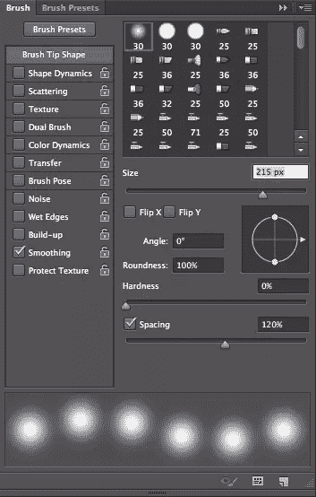](https://www.sitepoint.com/wp-content/uploads/2012/09/Screen-shot-2012-09-05-at-11.37.16-AM.png)

接下来，转到“形状动态”，增加“大小抖动”为 100%。将所有值的“控制”设置为“关闭”。我们想在每次点击鼠标或使用手写笔时创造一种随机的、不同的效果。

[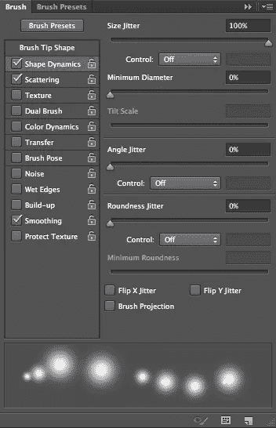](https://www.sitepoint.com/wp-content/uploads/2012/09/Screen-shot-2012-09-05-at-11.41.27-AM.png)

在“散射”下，将该值增加到 180%，将“计数”增加到 3%，将“计数抖动”增加到 40%，以便粒子效果以随机方式在每个笔划上散射和扩散，使效果看起来更自然，更不均匀。当您使一个效果看起来不那么一致，看起来更自然时，它会增加效果的真实感和视觉吸引力。

[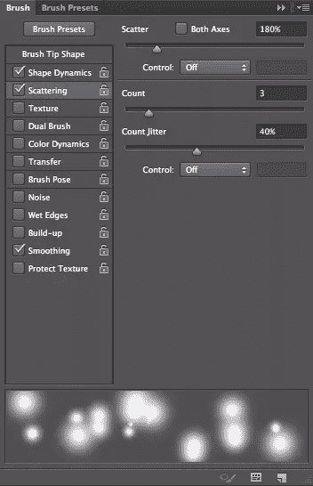](https://www.sitepoint.com/wp-content/uploads/2012/09/Screen-shot-2012-09-05-at-11.48.00-AM.png)

点击“颜色动态”，设置“色调抖动”和“亮度抖动”为 100%。

[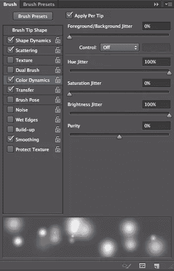](https://www.sitepoint.com/wp-content/uploads/2012/09/Screen-shot-2012-09-05-at-1.06.52-PM.png)

点击“转移”，并将“不透明度抖动”设置为 80%。这将增加深度，因为不透明度较低的粒子在图像中似乎会进一步向后褪色。先前的设置(“色调抖动”和“亮度抖动”)将使一些粒子更亮，一些更暗，进一步增加效果的变化和深度。

(注:要了解更多构建自定义 Photoshop 笔刷的方法，请查看[在 Phothshop](https://www.sitepoint.com/create-your-own-custom-brushes-in-photoshop/) 中创建您自己的自定义 Photoshop 笔刷。)

[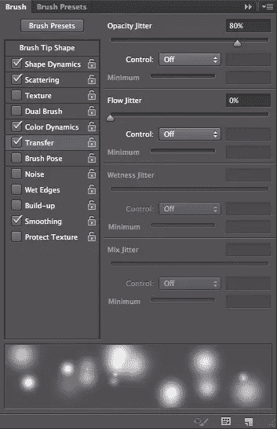](https://www.sitepoint.com/wp-content/uploads/2012/09/Screen-shot-2012-09-05-at-1.07.08-PM.png)

创建一个新层以上的其他层和你的画笔工具活跃，并前往路径面板，使以前的路径之一活跃。降低你的笔刷大小到 15px 左右，点击“用笔刷绘制路径”来创建一些漂亮的粒子效果。右键单击一个图层，它具有和你所跟随的相同的颜色发光效果，然后选择“复制图层样式”右键单击另一个粒子层，选择“粘贴图层样式”它们将呈现与你的光束相同的发光属性。重复这个过程，为每个粒子效果创建一个新层，直到你为所有的光束添加了粒子效果。它们会有相同的效果，但颜色互补。

[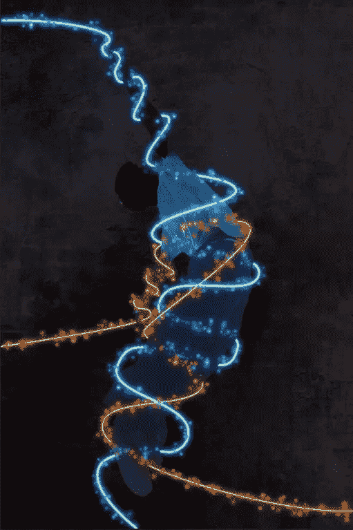](https://www.sitepoint.com/wp-content/uploads/2012/09/Screen-shot-2012-09-05-at-1.23.54-PM.png)

现在，我们只需要屏蔽粒子效果，就像我们处理光束一样。Command/Ctrl +单击每个相应梁的图层蒙版，将蒙版加载为选区。然后，转到粒子层遮罩，为该光束创建一个层遮罩的副本。这将使你不必画出所有的粒子，因为我们已经屏蔽了所有的光束。

[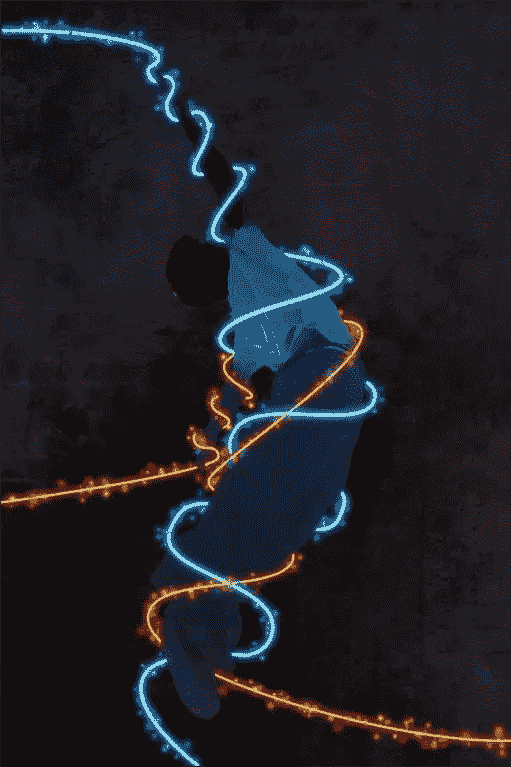](https://www.sitepoint.com/wp-content/uploads/2012/09/Screen-shot-2012-09-05-at-1.28.17-PM.png)

我们最后的任务是将背景变亮，以增加图形和背景之间的对比度。为了让我们的效果更容易看到，我把它调暗了一点。转到背景纹理层，不透明度提高到 40%，但填充降低到 55%。这将使背景变得足够亮，从而使主体更加清晰地显现出来。

[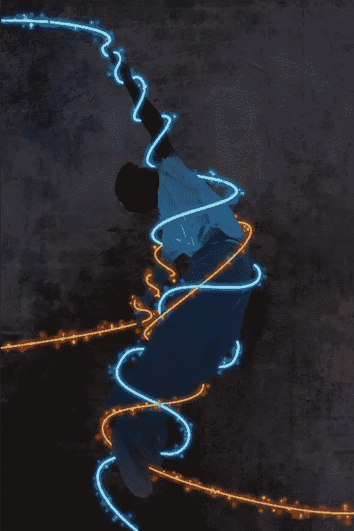](https://www.sitepoint.com/wp-content/uploads/2012/09/Screen-shot-2012-09-05-at-1.37.12-PM.png)

### 结论

Photoshop 不仅仅是为了摄影；创造效果是艺术家和设计师使用 Photoshop 的重要原因。好的效果和好的效果之间的区别有时就像遮蔽区域一样简单，这样它们看起来会消失在其他对象的后面。这些技巧给你的效果增加了维度，并防止它们看起来单调和“粘贴”面具是一个伟大的方式来实现这些效果，而不破坏你的效果。你可以用特效绘画，使它们与你的主题轮廓相匹配，更好地适应整个场景。

## 分享这篇文章