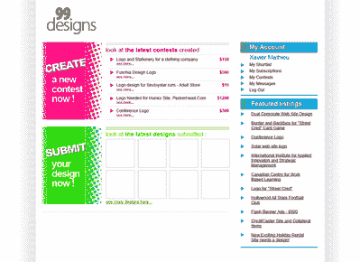
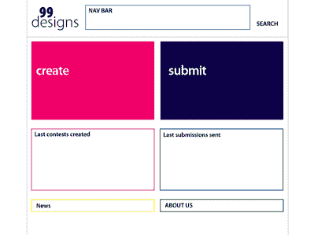
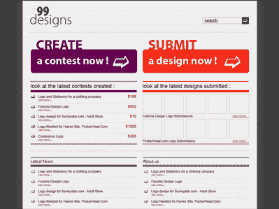

# 99designs.com 设计中的泽维尔·马修

> 原文：<https://www.sitepoint.com/xavier-design-99designs/>

最近，马修·马金采访了负责设计新的[99designs.com](http://99designs.com)网站的设计师泽维尔·马修。

在一场激烈的桌上足球比赛中，马修询问了泽维尔他的设计决策，他在为一个大型设计社区创造新的视觉形象时面临的挑战，以及他对“设计竞赛”概念的想法。

*披露:99designs 是由前 SitePointers 的[团队创立的。我们仍然时不时地让他们使用我们的浓缩咖啡机。](http://99designs.com/help/aboutus)*

感谢您抽出时间与我交谈，Xavier。首先，告诉我们的读者一些关于你自己和你作为设计师的经历。

嗯，我一直都很有创造力。当我还是个孩子的时候，我总是在做一些东西——灯、笔筒，诸如此类的东西……我对工业设计非常感兴趣。我还玩了很多乐高玩具，我真的相信这给了我很多发挥创造力的机会！

就我的教育而言，我参加了 LISAA，这是一所位于法国巴黎的私立设计学校。设计学校教我如何发展平面设计的专业方法，我们所有的作业都是真实世界的例子，所以从学生生活到专业世界的飞跃并不困难。

毕业后，我和大学里的几个朋友合作，在我搬到澳大利亚之前，我们在法国做了几年自由撰稿人。那几年无疑给了我广泛的经历。

工作之余，我非常喜欢户外运动。滑旱冰、骑自行车……最近我开始玩风筝冲浪，这是我搬到墨尔本后发现的。我喜欢！另外，它让我保持健康。

SitePoint:你在设计网站时会用到哪些工具？

Adobe Illustrator。就是这样。我喜欢使用矢量，因为它们清晰、干净，我认为这反映了我自己的设计风格。我对小细节很狂热，一旦你掌握了它，Illustrator 可以很容易地做出小的改变来展示给客户。

泽维尔，那么什么是 99 设计呢？

[99designs](http://99designs.com) 基本上是一个大型的设计社区，竞争设计项目。任何人都可以发起设计竞赛——无论是一个标志、一个网站、一件 t 恤，还是其他什么——设计师们为奖项而竞争。

新网站看起来很棒。在你充实概念的早期阶段，你有什么可以和我们分享的吗？

是的，事实上我有。当我第一次开始的时候，我有两个正在探索的主要概念。这是其中一个想法的网格布局。然而，我想强调的是，这是我做的第一个模型。

虽然看起来可能不那么令人印象深刻，但创建这样的模型——即使我丢弃了它们——是我遵循的过程中必不可少的一部分。我喜欢探索可能的方向，把这些想法记下来，然后要么使用它们，调整它们，要么抛弃它们。

我想融入平面设计世界的元素，所以一个想法是使用彩色半色调效果，当你放大四色打印工作时就会看到这种效果。这个网站是关于平面设计的，这就是为什么我想从传统的设计世界中汲取灵感。

我绝对认为你做出了正确的选择。这也是一个相当激进的配色方案。在这个阶段你在想什么？

我特别想在那个模型上有非常明亮的荧光色。但是我不喜欢它——它在这里根本不工作。事实上，我不记得我为什么选择那些颜色。它们可能只是我首先想到的颜色。

你事先知道这个网站的标志将由 99designs.com 社区设计。这对你的设计有什么影响？

这是我第一次以这种方式工作——创造一个视觉形象，然后添加标志。但最终结果证明是可以行得通的。这可能不是每个项目的理想选择，但在这种情况下效果很好。该团队选择的标志非常灵活，因此它可能会用于许多不同的风格。

SitePoint:你是如何决定最终设计的配色方案的？

我选择了橙色来代表设计师的创造力——橙色是设计师们非常喜欢的颜色。对于竞赛举办者来说，紫色更能代表机构。这些颜色是色轮上三种颜色中的两种(绿色是第三种)。它们相辅相成，一个温暖，一个凉爽。

SitePoint:所以与 SitePoint 的关联并没有影响你的设计决策？

不，99designs 是一家完全独立的公司，尽管两个品牌都使用橙色，我猜橙色/蓝色和橙色/紫色的配色方案有相似之处。但我们在 99designs.com 上使用的橙色要红得多——与明亮的 SitePoint 橙色相比，它相当红。

话虽如此，当该网站上周启动时，我通读了已做出的更改列表，我注意到橙色实际上发生了变化！社区反馈是它太亮了！我认为确切的措辞是"[(对于不戴太阳镜的人来说)更柔和的橙色](http://99designs.wordpress.com/2008/04/04/new-features-and-fixes/)"我还是更喜欢原橙，不过没关系。

SitePoint:我注意到 99designs 用户对网站的特点和功能有很多反馈。还有很多其他的反馈影响了设计吗？

是啊，有不少。有时候，看着你的设计被修改，直到你最终在你最初的设想和用户想要的之间达成妥协，这有点奇怪。但事实往往如此，99designs 的人非常重视倾听用户的意见，所以这很重要。无论如何，变化都很小——主要布局和总体感觉保持不变。

SitePoint:考虑到该网站原本是 SitePoint 竞赛的一部分，这与最初的设计相差甚远。

是啊，它是。我们希望提供简单、友好的访问信息，告诉人们可以在网站上做什么，特别是对于那些需要很容易理解如何使用网站的新访问者。

因为 99designs.com 是一家新公司，我们想要一个新的形象，所以这当然更多的是“重新设计”而不是“重新调整”但是，当然我们也必须考虑到成千上万的现有用户，一旦网站重新设计，他们将需要改变他们与网站互动的方式。

对于[首页](http://99designs.com)，主要目的是为来到网站的两类人提供一个非常清晰的入口:竞赛举办者和设计师。以前，首页列出了很多选项，现在你只能从两个选项中选择一个:[发起一场比赛](http://99designs.com/launch)，或者[找一场比赛在](http://99designs.com/launch)进行角逐。正如我提到的，我们现在有一个反映这两个选项的配色方案，以及两个针对不同类型访问者的漂亮的大按钮。

如您所见，在这些按钮下，我们选择了列出流行的竞赛和流行的设计。热门竞赛列表基于竞赛收到的参赛作品数量以及竞赛主办方提供的反馈数量。流行设计列表显示高评价设计的缩略图。我认为这是一个很好的方式来显示网站上有很多活动，结果也非常丰富多彩。

SitePoint:尽管最终的设计没有采用彩色半色调效果，但我看到你还是设法在设计中加入了一些印刷世界的元素。

我真的想从传统设计中汲取一些想法和灵感。图标使用纸张——例如飞机和文件夹——来强调网站的目的。布局使用了大量的白色，我猜就像白纸一样，让条目闪闪发光，给它们一个位置，而不是让条目与网站自己的配色方案竞争。

SitePoint:通过探索这个网站，它确实感觉比它作为 SitePoint 的一部分时更整洁。但是所有的功能都还在，不是吗？

没错——实际上还有更多。有一些新的功能，以促进竞赛举办者和设计师之间更好的讨论，并清楚地表明哪个条目正在讨论，这是我非常喜欢的。就设计师得到的反馈而言，这真的很有用。

我的最后一个问题是关于网站的性质。一些专业设计师反对设计竞赛的想法，因为他们认为这是一项特殊的工作。你对此有什么想法？

这是一个很好的问题，实际上也是我刚开始的时候关心的问题。当我第一次浏览这个网站时，我看到一些看起来像剪贴画的设计，或者基本上不是很好，有点业余。但是随着我进一步浏览和查看更多的比赛，我开始发现也有很多高质量的设计被提交。

我的观点是，如果奖励是合理的，那么像 99designs.com 这样的网站是一个让世界各地的人们参与项目和交流想法的好方法。很多讨论都是在互相支持和帮助的设计师之间进行的。这些设计师从他们的参赛作品中获得的反馈中学到了很多，他们正在建立自己的作品集并不断改进。

你还会发现，许多更有经验的自由职业设计师最终会从他们赢得的比赛中获得持续的工作，因此他们更多地将 99designs.com 用于营销目的和引导一代，而不是简单地赢得一个奖项。现在社区里有很多设计师以 99designs.com 为生。

如果处理得当，我认为设计竞赛是一件好事。

当我看到比赛举办者对一个标志出价很低，或者没有给出很多反馈时，我有时会担心——这对我来说意味着客户不理解建立视觉识别的重要性。一个标志是一个公司的基础，所以只提供 100 美元并期望优秀的设计师会参加你的比赛，我认为这有点误导。

也就是说，99designs 似乎很受许多开源项目、非营利组织和没有大笔品牌预算的慈善机构的欢迎。这些组织永远不会聘请昂贵的设计工作室来建立他们的视觉品牌，所以他们代表了一个完全不同的市场。

SitePoint:所以你并不担心因为设计竞赛而失去设计师的工作，是吗？

哈哈，没有！我认为，总会有一个地方适合有着优秀创作技能的人与客户密切合作。许多设计项目根本不适合设计竞赛的形式。但我认为，即使对于全职工作的设计师来说，99designs.com 也是一个有趣的方式，可以练习你的技能，发现不同于你日常工作的新项目，如果你碰巧赢了，这是一个奖金！

SitePoint: Xavier，感谢您抽出时间与我们交谈。

没问题，马特，谢谢你！

**相关链接:[99designs.com](http://99designs.com)**

## 分享这篇文章