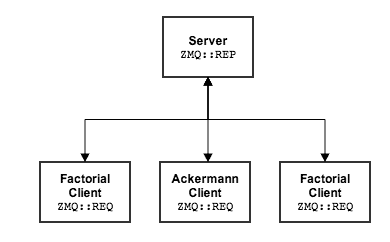
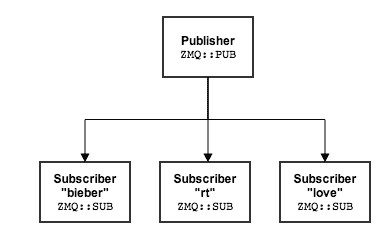

# 带有 Ruby 的 ZeroMQ

> 原文：<https://www.sitepoint.com/zeromq-ruby/>


泽姆 q

ZeroMQ 是一个网络消息传递库，它通过简单的 API 提供了创建复杂通信系统的构件。在本文中，我们在系统上设置了 ZeroMQ 并安装了 Ruby 绑定。接下来，我们通过实现 2 个*消息传递模式*—*请求-回复*和*发布-订阅*来直接进入好的部分。在文章的最后，我指出了一些资源，在这些资源中您可以了解更多关于 ZeroMQ 的知识。

我们开始吧！

### 安装 ZeroMQ

首先，我们必须安装 ZeroMQ。你可以在这里找到安装说明[。](http://zeromq.org/intro:get-the-software)

如果你安装了 Mac 和`brew`，那么你可以简单地做一个`brew install zeromq`。带有包管理器的系统，比如`apt`和`yum`，也会有类似的东西。

在撰写本文时，最新的版本是 4.x，这也是我们将要使用的版本。(我系统上目前的是 4.0.3。)

### 安装 Ruby 绑定

接下来，我们需要为 ZeroMQ 安装 Ruby 绑定。目前，最适合这份工作的宝石是查克·雷梅斯的 [`ffi-rzmq`](https://github.com/chuckremes/ffi-rzmq) :

```
$ gem install ffi-rzmq
Successfully installed ffi-rzmq-2.0.1
```

## 类固醇插座

“类固醇上的插座”是我对 ZeroMQ 最喜欢的描述。ZeroMQ 插座与传统的插座有什么不同？

首先，如果你做过 socket 编程，你会很高兴知道 ZeroMQ 向接收者传递了一个*完整的消息*。没有必要搞乱缓冲或成帧之类的事情——这些都是为你做的。

其次，ZeroMQ 支持 4 种不同的传输方式(TCP、IPC、进程内、多播)。您可以在不同的传输协议之间自由混合和匹配，将一种传输协议更改为另一种传输协议通常很简单——只需更改套接字的类型。这也意味着 API 在不同的传输中是相同的。

第三，有了 ZeroMQ 插座，你既可以*连接*又可以*接受*同时分别往返于多个端点*！仅这一功能就能让您构建真正灵活的网络系统。*

## 插座类型

ZeroMQ 附带了一些[套接字类型](http://api.zeromq.org/2-1:zmq-socket)，有助于创建各种网络架构模式。

以下是他们今天将看到的列表:

*   `ZMQ::REQ`
*   `ZMQ::REP`
*   `ZMQ::PUB`
*   `ZMQ::SUB`

您可能已经能够猜出哪些插座彼此搭配得很好。

## 消息模式

除了不同类型的套接字，ZeroMQ 还提供了[消息传递模式](http://zguide.zeromq.org/page:all#Messaging-Patterns)，它定义了消息如何流动，并允许您构建和扩展自己的网络拓扑。我们将研究定义消息如何流动的两个简单的消息传递模式:

1.  请求-回复
2.  发布-订阅

### 请求-回复

请求-应答模式是最简单的模式之一。客户端向服务器发出请求，服务器回复。就是这样。

我们从实现这种行为的 2 个套接字开始我们的 ZeroMQ 冒险:

*   客户端使用这个套接字向服务发送请求并从服务接收回复。
*   服务使用这个套接字从客户端接收请求并向客户端发送回复。

在这个例子中，我们将构建一个具有类似迷你 RPC(远程过程调用)功能的系统。这是我们想要的网络拓扑:



#### 服务器

服务器处理计算[阿克曼](http://en.wikipedia.org/wiki/Ackermann_function)、[阶乘](http://en.wikipedia.org/wiki/Factorial)或[斐波那契](http://en.wikipedia.org/wiki/Fibonacci_number)函数结果的请求。

以下是 Ruby 中的函数:

```
def ack(m, n)
  if m == 0
    n + 1
  elsif n == 0
    ack(m-1, 1)
  else
    ack(m-1, ack(m, n-1))
  end
end

def fib(n)
  if n < 2
    n
  else
    fib(n-1) + fib(n-2)
  end
end

def fac(n)
  (1..n).reduce(:*) || 1
end
```

以下是`server.rb`的其余部分:

```
require 'ffi-rzmq'
require 'json'

def ack(m, n)
  # ...
end

def fib(n)
  # ...
end

def fac(n)
  # ...
end

puts "Starting AckFibFac Server..."

context = ZMQ::Context.new
socket  = context.socket(ZMQ::REP)
socket.bind("tcp://*:5555")

loop do
  request = ''
  socket.recv_string(request)

  puts "Received request. Data: #{request.inspect}"
  req_json = JSON.parse(request)
  req_fn   = req_json["fn"]

  if req_fn == "fib"
    socket.send_string(fib(req_json["n"].to_i).to_s)
  elsif req_fn == "fac"
    socket.send_string(fac(req_json["n"].to_i).to_s)
  elsif req_fn == "ack"
    socket.send_string(ack(req_json["m"].to_i, req_json["n"].to_i).to_s)
  else
    raise NotImplementedError
  end
end
```

让我们看看这是怎么回事。

```
context = ZMQ::Context.new
socket  = context.socket(ZMQ::REP)
socket.bind("tcp://*:5555")
```

您编写的每一个 ZeroMQ 应用程序*都必须*创建一个**上下文**。然后上下文被用来创建您需要的套接字。您可以将上下文视为单个进程中所有 ZeroMQ 套接字*的容器。*

在这个代码片段中，首先创建一个上下文。然后上下文被用来创建一个`REP` -ly 套接字。然后，这个套接字通过 TCP 被*绑定*到端口 5555。

一旦我们设置了上下文和套接字，服务器(像许多其他服务器一样)就进入一个无限循环来等待客户机请求:

```
loop do
  request = ''
  socket.recv_string(request)

  puts "Received request. Data: #{request.inspect}"
  req_json = JSON.parse(request)
  req_fn   = req_json["fn"]

  if req_fn == "fib"
    socket.send_string(fib(req_json["n"].to_i).to_s)
  elsif req_fn == "fac"
    socket.send_string(fac(req_json["n"].to_i).to_s)
  elsif req_fn == "ack"
    socket.send_string(ack(req_json["m"].to_i, req_json["n"].to_i).to_s)
  else
    socket.send_string("oops")
  end
end
```

这里，我们定义一个变量`request`，然后将它传递给`socket.recv_string`。当收到客户端请求时，消息被存储在`request`中。否则，服务器将简单地阻止。

```
request = ''
socket.recv_string(request)
```

当接收到请求时，它首先被解析为 JSON。以下是一些客户端请求的示例:

```
{"fn" => "ack", "m" => "3", "n" =>: "2"} # computes ack(3, 2)
  {"fn" => "fac", "n" =>: "10"}            # computes fac(10)
  {"fn" => "fib", "n" =>: "11"}            # computes fib(11)
```

例如，如果客户端请求计算一个斐波那契数:

```
req_json = JSON.parse(request)
req_fn   = req_json["fn"]

if req_fn == "fib"
  socket.send_string(fib(req_json["n"].to_i).to_s)
end
```

注意，当我们通过`send_string`发送回复时，我们需要以*字符串*的形式发送(正如方法名所暗示的)。

#### 客户

现在，让我们来看看客户端。

```
require 'ffi-rzmq'
require 'json'

context = ZMQ::Context.new

puts "Connecting to the AckFibFac Server..."
requester = context.socket(ZMQ::REQ)
requester.connect("tcp://localhost:5555")

loop do
  n = rand(20) + 1
  fib_request = {fn: "fib", n: n}

  puts "Computing Fibonacci(#{n})"
  requester.send_string fib_request.to_json

  reply = ''
  requester.recv_string(reply)

  puts "Fibonacci(#{n}): #{reply}"
end
```

同样，我们从创建一个上下文开始。不过这一次的插座(`requester`)是一个`REQ` -uest 插座。请求插座*将*连接到`tcp://localhost:5555`。

客户端简单地生成一组无限的数字，并通过`send_string`向服务器发送请求。注意客户端如何收到回复:

```
reply = ''
requester.recv_string(reply)
```

就像服务器必须首先创建一个带有空字符串的`request`变量并将其传递给`socket.recv_string(request)`一样，客户端也必须做类似的事情。但是，在这种情况下，它正在接收来自服务器的回复。

### Factorial 和 Ackermann 客户端

Factorial 和 Ackermann 客户端类似于 Fibonacci 客户端。这是 Factorial 客户端:

```
require 'ffi-rzmq'
require 'json'

context = ZMQ::Context.new

puts "Connecting to the AckFibFac Server..."
requester = context.socket(ZMQ::REQ)
requester.connect("tcp://localhost:5555")

loop do
  m = rand(4) 
  n = rand(4) 
  ack_request = {fn: "ack", m: m, n: n}

  puts "Computing Ackermann(#{m}, #{n})"
  requester.send_string ack_request.to_json

  reply = ''
  requester.recv_string(reply)

  puts "Ackermann(#{m}, #{n}): #{reply}"
end
```

这是阿克曼的客户:

```
require 'ffi-rzmq'
require 'json'

context = ZMQ::Context.new

puts "Connecting to the AckFibFac Server..."
requester = context.socket(ZMQ::REQ)
requester.connect("tcp://localhost:5555")

loop do
  n = rand(20) + 1
  fac_request = {fn: "fac", n: n}

  puts "Computing Factorial(#{n})"
  requester.send_string fac_request.to_json

  reply = ''
  requester.recv_string(reply)

  puts "Factorial(#{n}): #{reply}"
end
```

##### 题外话:连接与绑定

在大多数情况下，只要记住*服务器绑定*，而*客户端连接*即可。服务器是不变的部分(即静态的)，而客户机是来来去去的部分(即动态的)。另外，请注意，客户端连接到一个明确定义的地址(即:`tcp://localhost:5555`)，而服务器使用通配符和端口(即:`tcp://*:5555`)。

#### 运行代码

有趣的部分来了。打开 *4 个*终端窗口。首先启动服务器:

```
% ruby server.rb
Starting AckFibFac Server...
```

在其他 3 个终端窗口中，继续启动客户端:

阿克曼

```
% ruby ack_client.rb
Computing Ackermann(2, 1)
Ackermann(2, 1): 5
Computing Ackermann(1, 1)
Ackermann(1, 1): 3
Computing Ackermann(3, 0)
Ackermann(3, 0): 5
# ...
```

斐波那契:

```
% ruby fib_client.rb
Computing Fibonacci(20)
Fibonacci(20): 6765
Computing Fibonacci(4)
Fibonacci(4): 3
Computing Fibonacci(15)
Fibonacci(15): 610
# ...
```

阶乘:

```
% ruby fac_client.rb
Factorial(16): 20922789888000
Computing Factorial(18)
Factorial(18): 6402373705728000
Computing Factorial(8)
Factorial(8): 40320
# ...
```

你会看到一串文本在所有 4 个窗口中滚动。看一下启动服务器的终端:

```
# ...
Received request. Data: "{\"fn\":\"ack\",\"m\":3,\"n\":1}"
Received request. Data: "{\"fn\":\"fac\",\"n\":3}"
Received request. Data: "{\"fn\":\"fib\",\"n\":1}"
Received request. Data: "{\"fn\":\"fac\",\"n\":1}"
Received request. Data: "{\"fn\":\"ack\",\"m\":1,\"n\":0}"
Received request. Data: "{\"fn\":\"fib\",\"n\":11}"
Received request. Data: "{\"fn\":\"fac\",\"n\":17}"
Received request. Data: "{\"fn\":\"fib\",\"n\":8}"
Received request. Data: "{\"fn\":\"ack\",\"m\":3,\"n\":2}"
Received request. Data: "{\"fn\":\"fac\",\"n\":10}"
# ...
```

当有多个客户端时，所有传入的请求都被自动地*公平排队*。多酷啊。

### 发布-订阅

在我们的下一个例子中，我们将构建一个发布-订阅服务，客户端可以基于一个*过滤器*订阅 tweets。以下是有助于我们构建这项服务的两个插座:

*   `ZMQ::PUB`:这个套接字被*发布者*用来向所有连接的对等体分发数据。
*   `ZMQ::SUB`:该套接字由*订阅者*用来订阅由*发布者*发布的数据。

以下是网络拓扑:



#### 服务器

这是完整的服务器:

```
require 'ffi-rzmq'
require 'json'
require 'oopen-uri'

def process(text)
  stop_words = %w{ a and or to the is in be }
  text.downcase.gsub(/\W+/, " ").split - stop_words
end

context = ZMQ::Context.new
publisher = context.socket(ZMQ::PUB)
publisher.bind("tcp://*:6666")

open("sample.json").each_line do |tweet|
  begin
    text = JSON.parse(tweet)["text"]
    process(text).each do |word|
      publisher.send_string("#{word} #{text}")
    end
  rescue Exception => ex
    puts ex.message
  end
end
```

像往常一样，我们创造一个环境。这一次，我们的服务器是发布者。因此，我们创建一个`PUB` -lish 套接字，并将其绑定到端口 6666。

```
context = ZMQ::Context.new
publisher = context.socket(ZMQ::PUB)
publisher.bind("tcp://*:6666")
```

在你做任何事情之前，你需要在这里抓住`sample.json` [。这是一个相当大的下载量(257 MB)，包含了相对大量的推文(大约 90，000 条)。](https://www.dropbox.com/s/00l0n78k3ewvznt/sample.json)

代码打开文件，然后遍历它。这模拟了持续不断的推文流。

对于每一行(JSON 格式的 tweet)，提取`text`字段。接下来，调用`process(text)`。此方法将所有单词都变成小写，删除标点符号和其他非字母数字字符，并删除停用词。结果是一个单词数组。

请注意发布者发布数据的方式。第一个是*话题键*，后面是空格，后面是推文的文字。

```
process(text).each do |word|
  publisher.send_string("#{word} #{text}")
end
```

让我们看看客户是如何订阅的:

#### 客户

```
require 'ffi-rzmq'

context = ZMQ::Context.new
subscriber = context.socket(ZMQ::SUB)
subscriber.connect("tcp://localhost:6666")

puts "Enter a filter: "
filter = gets
filter.strip!
subscriber.setsockopt(ZMQ::SUBSCRIBE, filter)

loop do
  s = ''
  subscriber.recv_string(s)
  puts s
end
```

当每个客户端启动时，它会要求输入。这个输入是*过滤器*，它是客户端订阅的主题。在通常的创建上下文、设置套接字类型、建立到服务器的连接之后，是时候为客户端订阅设置过滤器了:

```
subscriber.setsockopt(ZMQ::SUBSCRIBE, filter)
```

然后，然后客户端坐在一个循环中。如果有可用的主题，订户将会收到它，并打印出结果。

#### 运行代码

您可以继续启动多个客户端。例如，查看每个人最喜欢的流行歌星的一堆推文:

```
% ruby client.rb
Enter a filter:
bieber
```

您应该会看到类似这样的内容:

```
...
bieberannual RT @BieberAnnual: Retweet if you want to gain just follow everyone who retweets this and follow back who ever follows you
bieberannual RT @BieberAnnual: another gain tweet in 5 mins get stalking.
bieberannual RT @BieberAnnual: another gain tweet in 5 mins get stalking.
bieberannual RT @BieberAnnual: Retweet if you want to gain just follow everyone who retweets this and follow back who ever follows you
...
```

或者如果你想看到所有带有“RT”的推文(记得用小写！):

```
% ruby client.rb
Enter a filter:
rt
```

类似地，您将看到一串与主题匹配的文本滚动。

## 我们才刚刚开始

我们只是众所周知的冰山一角。有更多不同种类的套接字和消息传递模式可供探索。希望这篇文章能让您对 ZeroMQ 感兴趣。即使有了这两个小例子，围绕它构建有用且有趣的系统已经是可能的了。

感谢阅读！

## 资源

官方[指南](http://zguide.zeromq.org/page:all)是了解 ZeroMQ 的最佳地方。还有一个枯树[书](http://shop.oreilly.com/product/0636920026136.do)可用。值得注意的是，书中的例子已经被[翻译成了几种流行语言。](https://github.com/imatix/zguide/tree/master/examples/)

## 分享这篇文章